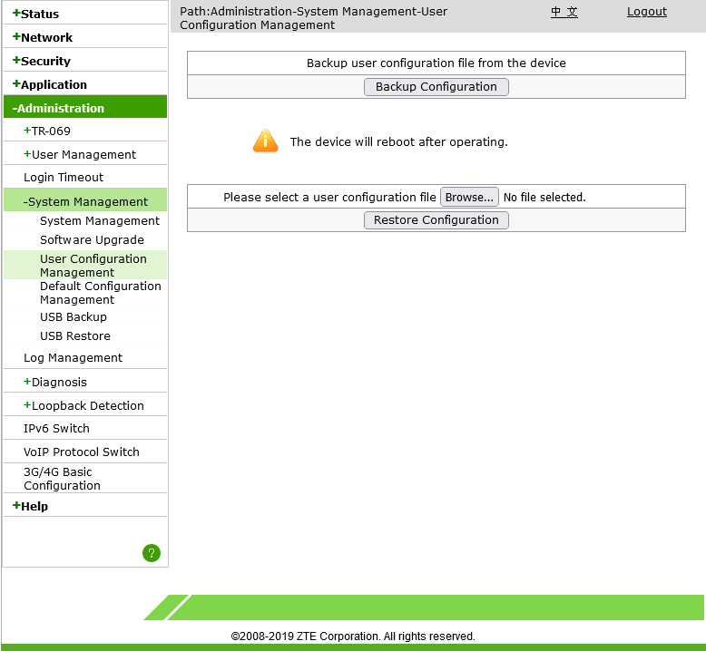
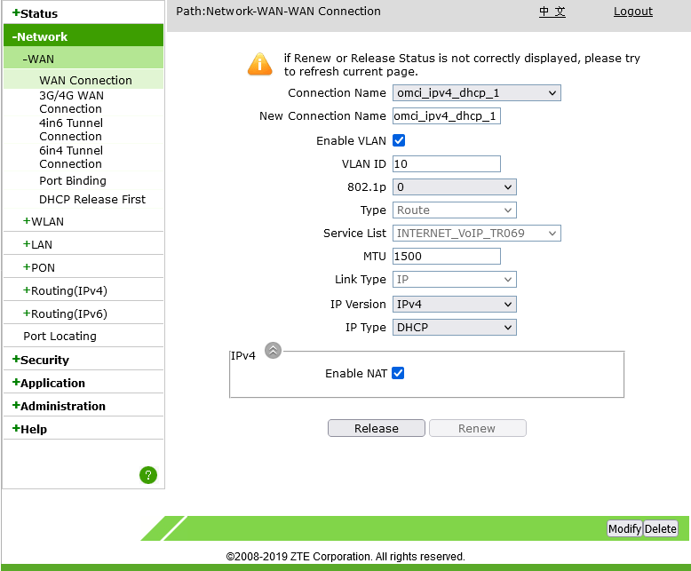
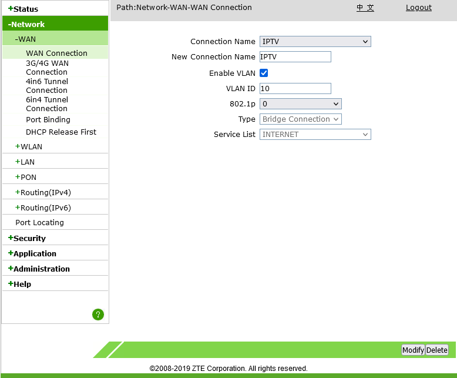
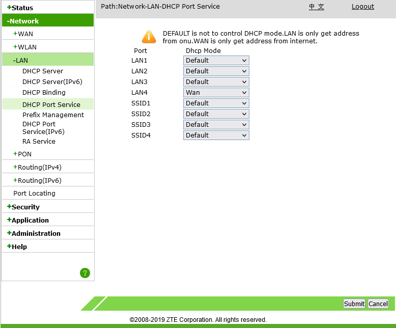
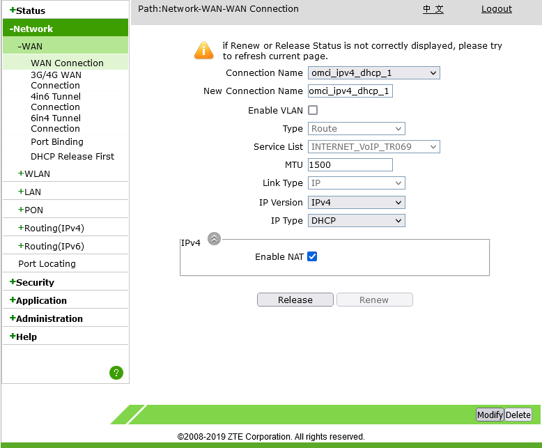
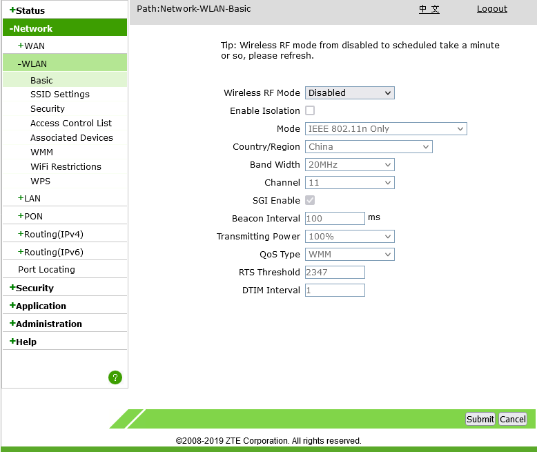

# How to bridge mode Converge ZTE modem
Tested on F660 and F670L

1. Sign in using SuperAdmin.
   1. Username: admin
   2. Password: Converge@zte123
2. Backup configurations.
   1. Administration > System Management > User Configuration Management > Backup Configuration
   2. Administration > System Management > Default Configuration Management > Backup Configuration

3. Get VLAN ID of omci_ipv4_dhcp_1.
   1. Network > WAN > WAN Connection
   2. Under Connection Name dropbox, click "omci_ipv4_dhcp_1".
   3. Remember VLAN ID, mine is 10.

4. Get VLAN ID of IPTV and replace the VLAN ID of IPTV with the VLAN ID of omci_ipv4_dhcp_1.
   1. Network > WAN > WAN Connection
   2. Under Connection Name dropbox, click "IPTV".
   3. Remember VLAN ID, mine is 3225.
   4. Replace VLAN ID with the VLAN ID of the omci_ipv4_dhcp_1, mine is 10, so I put 10, replacing 3225.
   5. Click Modify.

5. Disable DHCP on LAN 4 port. (Much better than disabling DHCP on whole ONU.)
   1. Network > LAN > DHCP Port Service
   2. Under LAN4 dropbox, from Default, change to Wan.

Bridged already! Connect router to LAN4 port.

At this point 2 routers are connected to Converge's router (the CGNAT), your Converge provided modem/router combo (the ZTE ONU) and your own router. We need to disable the connection of the ONU because sayang lang yung connection, at baka magtaka pa yung Converge bakit dalawa ang naka connect na router sa isang bahay.

6. Disable connection from ONU.
   1. Go to Network > WAN > WAN Connection
   2. Under Connection Name dropbox, click "omci_ipv4_dhcp_1".
   * Disable method
      1. Uncheck Enable VLAN.
      2. Click Modify.
   * Disconnect method
      1. Click Release.
   * Delete method
      1. Click Delete.

Every time na nirestart mo modem mo, kailan mong gawin ulit ito, sinet na ito ng Converge, medyo hassle pero safe kung sakali na kailanganin mo yung internet sa ONU lang mismo.

Once na disable na yung connection ng ONU, mawawala yung ilaw ng "Internet" doon sa ONU, ok lang iyon, ibig sabihin di na nakaconnect sa internet yung ONU, pero yung router mo na naka bridge naka connect padin.

7. Disable WiFi
   1. Network > WLAN > Basic
   2. Under Wireless RF Mode dropbox, click Disabled.
   3. Click Modify.

Notes:
No need to clone MAC address, hindi ganon ka stricto si Converge sa mga naka bridge mode. But you can clone it if you want.\
Kapag naka connect ka doon sa own router mo, di mo na ma-aacess yung GUI ng ONU, para ma-aacess mo yung ONU, connect ka ulit doon sa LAN 1-3 ng ONU.