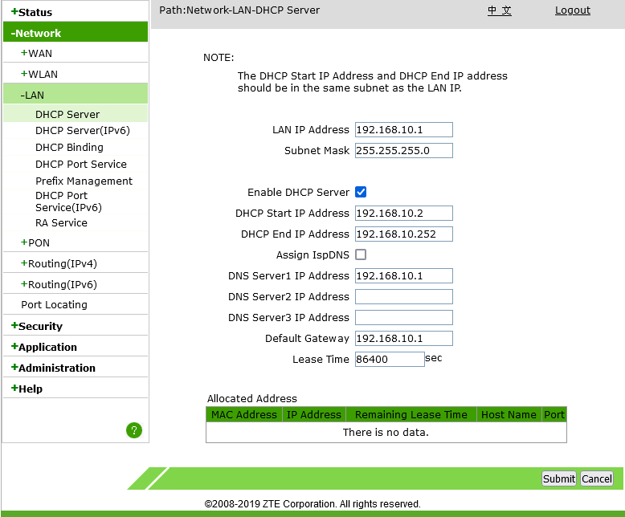

# How to bridge mode Converge ZTE modem
Tested on ZTE F660 and ZTE F670L

## Setup bridge mode

1. Sign in using SuperAdmin.
   1. Username: `admin`
   2. Password: `Converge@zte123`
2. Backup configurations.
   1. Administration > System Management > User Configuration Management > Backup Configuration
   2. Administration > System Management > Default Configuration Management > Backup Configuration

3. Get VLAN ID of omci_ipv4_dhcp_1.
   1. Network > WAN > WAN Connection
   2. Under Connection Name dropbox, click "omci_ipv4_dhcp_1".
   3. Remember VLAN ID, mine is 10.

4. Get VLAN ID of IPTV and replace the VLAN ID of IPTV with the VLAN ID of omci_ipv4_dhcp_1.
   1. Network > WAN > WAN Connection
   2. Under Connection Name dropbox, click "IPTV".
   3. Remember VLAN ID, mine is 3225.
   4. Replace VLAN ID with the VLAN ID of the omci_ipv4_dhcp_1, mine is 10, so I put 10, replacing 3225.
   5. Click Modify.

5. Disable DHCP on LAN 4 port. (Much better than disabling DHCP on whole ONU.)
   1. Network > LAN > DHCP Port Service
   2. Under LAN4 dropbox, from Default, change to Wan.
   3. Click Submit.

Bridged already! Connect router to LAN4 port.

At this point 2 routers are connected to Converge's router (the CGNAT), your Converge provided modem/router combo (the ZTE ONU) and your own router. We need to disable the connection of the ONU because sayang lang yung connection, at baka magtaka pa yung Converge bakit dalawa ang naka connect na router sa isang bahay.

6. Disable connection from ONU.
   1. Go to Network > WAN > WAN Connection
   2. Under Connection Name dropbox, click "omci_ipv4_dhcp_1".
   * Disable method. (Recommended method.)
      1. Uncheck Enable VLAN.
      2. Click Modify.
   * Disconnect method. (Alternative method.)
      1. Click Release.
   * Delete method. (Not recommended.)
      1. Click Delete.

Every time na nirestart mo modem mo, kailan mong gawin ulit ito, sinet na ito ng Converge, medyo hassle pero safe kung sakali na kailanganin mo yung internet sa ONU lang mismo.

Once na disable na yung connection ng ONU, mawawala yung ilaw ng "Internet" doon sa ONU, ok lang iyon, ibig sabihin di na nakaconnect sa internet yung ONU, pero yung router mo na naka bridge naka connect padin.

7. Disable WiFi
   1. Network > WLAN > Basic
   2. Under Wireless RF Mode dropbox, click Disabled.
   3. Click Submit.

## Clone MAC address
I have discovered that Converge uses modem's MAC address for bandwidth limiter, since I haven't cloned the MAC address ever since, and still getting 120 mbps while I should be getting 250 mbps, I tried to clone MAC address, and the speed becomes 250 mbps. So it is necessary, not mandatory, to clone the MAC address.

1. Go to Status > Network Interface > WAN Connection
2. The WAN MAC address under omci_ipv4_dhcp_1 is the one you should copy, and clone it to your router's WAN interface.

If you cloned your MAC address, every time the router got rebooted, the modem will connect to the internet, it will cause a MAC address collision, preventing you from accessing the internet, you need to disable the connection first from the modem before the router gets a DHCP lease so that the router will get internet.\
This is why it is better if your router supports multiple IP address so that you can disable it without connecting to LAN 1-3 ports.\
If a collision already happened, just disable the connection from ONU, and renew DHCP lease on the router.

## Connect to bridged modem behind router
Normally when in bridge mode, you can't access the modem GUI from the router, requiring you to connect to LAN 1-3 just to disable connection from ONU. But if you have a router that allows adding multiple IPs like MikroTik, you can access the bridged modem behind your router.

1. Change the modem LAN IP address to a different subnet than your router. For example, if your router has `192.168.1.1`, change the IP address of the modem to `192.168.10.1`.
   1. Network > LAN > DHCP Server
   2. Change LAN IP Address to a different subnet, my router has `192.168.1.1`, so I change it to `192.168.10.1`.
   3. Click Submit.

2. Add another IP address on the WAN side of the router. The router IP address should be in the same subnet and different address as the modem.
   1. For MikroTik, if your modem is on `192.168.10.1`, use this command:\
   `/ip address add address=192.168.10.2/24 interface=ether1`\
   This will add another IP address of the router to `192.168.10.2`, allowing you to access the modem at `192.168.10.1`.

3. Now you can access the modem from behind the router by going to `192.168.10.1`.

## Problems
If you followed this guide, got messed up, and you lost access to the internet, please, DO NOT HARD RESET YOUR MODEM! You have been warned.\
A simple reboot of the modem will probably fix the problem, and allows you to access the internet again.\
If a simple reboot did not fix the problem, restoring the configuration backup you made earlier from the User Configuration Management will fix it on the last resort.

## Other information
* Alternative bridge mode guide for [ZTE F670L by marfillaster](https://gist.github.com/marfillaster/5cfdc5d2c9e0bed3d8979f07944c051a).
* Bridge mode for [Huawei modem on TipidPC by Ominous](https://tipidpc.com/viewtopic.php?tid=298525&page=468).