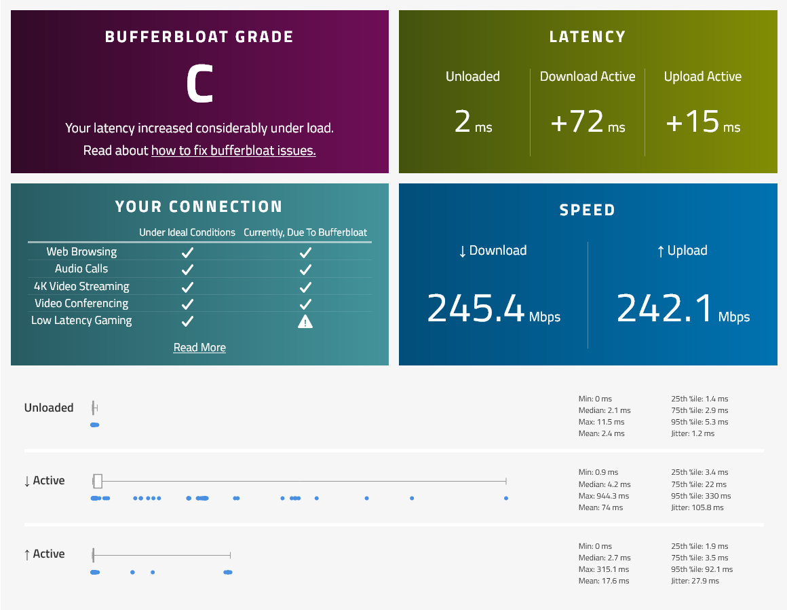
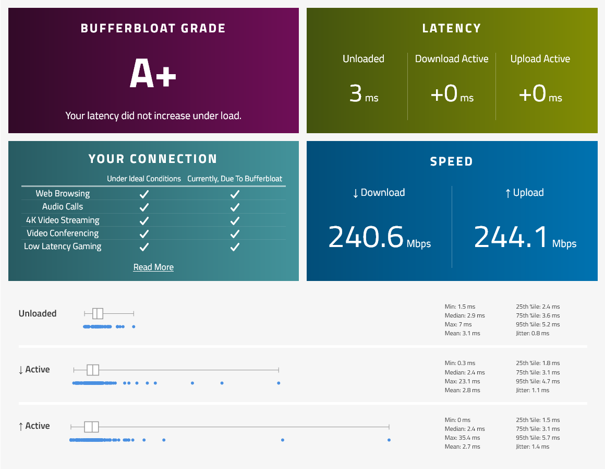
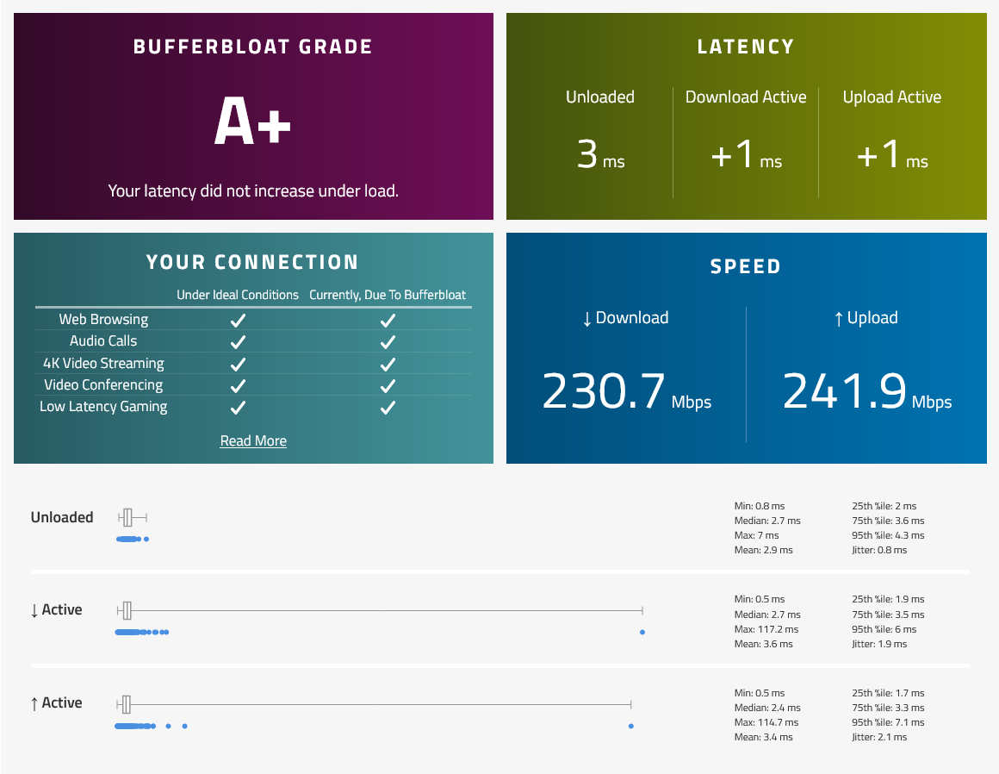

Bufferbloat is a problem for many of us gamers and users that need low latency internet just because the counters at the supermarket don't want to let someone with a single item to cut into the queue of people with multiple items in the cart.[^1]\
We aim to fix that problem by letting someone with a single item in the checkout lane cut though the line using Smart Queue Management (SQM)[^2].

FastTrack is a feature in MikroTik RouterOS that packets that are marked "fast-tracked" will bypass some of a processing in the router (firewall, connection tracking, etc.)[^3], this will reduce processing overhead and allow to have higher speeds achievable on the router.[^4]\
The problem is that FastTrack bypasses simple queues, which are used for SQM. Queue tree that are parented to global also bypasses FastTrack. We will instead use queue tree that are parented to interface and apply SQM there.

There are 2 algorithms that we can use for SQM in MikroTik, Fair/Flow Queueing Controlled Delay (FQ-CoDel)[^5] and Common Applications Kept Enhanced (CAKE).[^6] You can use either of those, but I recommend using FQ-CoDel, since it is "fair" (got it?).

## Enabling Smart Queue Management

1. Measure your internet speed on [Speedtest.net](https://www.speedtest.net) and know your advertised speed on your ISP.\
Choose how much speed to sacrifice for SQM. Some people recommend 90% of speed,[^7] for example my internet is 250 Mbps, I will set max-limit to 225 Mbps, sacrificing 25 Mbps.\
But for my setup, I sacrifice 1 Mbps, so I set max-limit to 249 Mbps. Remember that max-limit must not be equal or higher than your internet speed, or else it will not work.\
For asymmetrical internet speed, specify max-limit depending on the upload and download speed. For example, upload speed is 50 Mbps, download speed is 100 Mbps, max-limit on upstream should be 49 Mbps, downstream should be 99 Mbps.

2. Measure Bufferbloat on your internet using [Waveform Bufferbloat Test](https://www.waveform.com/tools/bufferbloat) to check for Bufferbloat before SQM has been enabled.

### Fair/Flow Queueing Controlled Delay (FQ-CoDel)
1. Add FQ-CoDel on Queue Types.\
`/queue type add kind=fq-codel name=fq-codel`
2. Add Queue Tree on upstream (from your router going to the internet) by specifying the WAN interface in parent. My WAN interface is ether1. Set the max-limit to your chosen speed upstream, I chosen 249 Mbps, so it will be 249M.\
`/queue tree add max-limit=249M name=queue-upload packet-mark=no-mark parent=ether1 queue=fq-codel`
3. Add Queue Tree on downstream (from the internet going to your router) by specifying the LAN interface in parent. My LAN interface is bridge. Set the max-limit to your chosen speed downstream, since I have symmetrical internet speed, it will be the same as upstream.\
`/queue tree add max-limit=249M name=queue-download packet-mark=no-mark parent=bridge queue=fq-codel`
4. Measure Bufferbloat on your internet using [Waveform Bufferbloat Test](https://www.waveform.com/tools/bufferbloat) to check if there is any changes in latency after SQM has been enabled.

### Common Applications Kept Enhanced (CAKE)
Configuration is the same with FQ-CoDel except the algorithm.

1. Add CAKE on Queue Types.\
`/queue type add kind=cake name=cake`
2. Add Queue Tree on upstream.\
`/queue tree add max-limit=249M name=queue-upload packet-mark=no-mark parent=ether1 queue=cake`
3. Add Queue Tree on downstream.\
`/queue tree add max-limit=249M name=queue-download packet-mark=no-mark parent=bridge queue=cake`

[Before SQM](https://www.waveform.com/tools/bufferbloat?test-id=4807dfc8-9abc-4a64-a5ba-220fb2401638) | [FQ-CoDel](https://www.waveform.com/tools/bufferbloat?test-id=042c264d-f218-4b00-9933-6d922b05fa2c) | [CAKE](https://www.waveform.com/tools/bufferbloat?test-id=df44b2e1-04eb-4d1c-8483-0adbf4e7f109)

[^1]: [Bufferbloat in layman's terms and router hacking, 101](https://www.tnhh.net/posts/bufferbloat-in-laymans-terms.html)
[^2]: [Smart Queue Management](https://www.bufferbloat.net/projects/cerowrt/wiki/Smart_Queue_Management/)
[^3]: [Manual:IP/Fasttrack](https://wiki.mikrotik.com/wiki/Manual:IP/Fasttrack)
[^4]: [Fasttrack - MikroTik - Forum #4](https://forum.mikrotik.com/viewtopic.php?t=180035#p889189)
[^5]: [RFC 8290: The Flow Queue CoDel Packet Scheduler and Active Queue Management Algorithm](https://www.rfc-editor.org/rfc/rfc8290)
[^6]: [Piece of CAKE: A Comprehensive Queue Management Solution for Home Gateways](https://arxiv.org/pdf/1804.07617.pdf)
[^7]: [MikroTik Routers (fq_codel)](https://www.stoplagging.com/mikrotik-routers-fq_codel/)