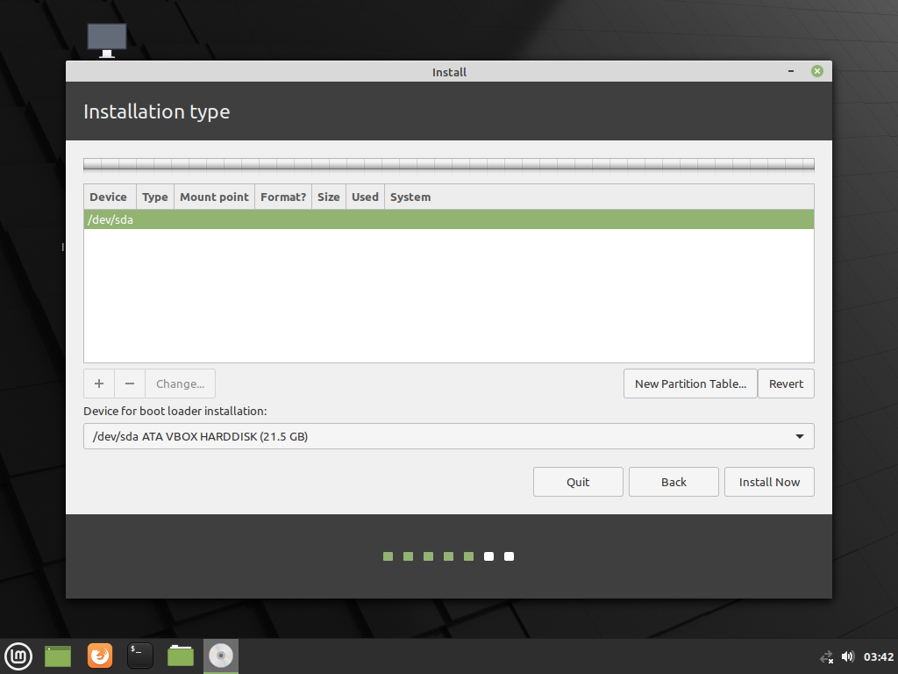

Do you want to use Timeshift on Linux Mint just like System Restore in Windows?

The B-tree file system or Btrfs is a file system on Linux that ~~behaves like the NTFS on Windows~~. Btrfs is actually better than NTFS because it uses Copy-on-write while NTFS is just a Journaling Filesystem.\
The ext4 file system is a pure file system, do it's one job, no extra stuff like NTFS or Btrfs.\
When you use Timeshift on ext4, it uses rsync to make copies of the files, above the file system, that is why it is slow.\
When you use System Restore on NTFS, the copies of the files are made as an atomic transaction to the file system, that is why it is fast.\
Timeshift on Btrfs behaves like System Restore in Windows.

## Install Linux Mint on Btrfs
This will erase everything on your hard drive.

1. Open Linux Mint installer and follow everything up to Installation Type.
2. At installation type, click Something else.

3. Click New Partition Table

 

4. Click free space, and click + (plus).

### UEFI
5. Make a 128 MB partition, use as EFI System Partition, leave other options at default.

6. Click the next free space, and click + (plus).

7. Use as Btrfs journaling file system with a mount point at '/', leave other options at default.

8. Click Install Now, and follow the installation.

#### GRUB always wait 30 seconds on boot

A [patch](https://bugs.launchpad.net/ubuntu/+source/grub2/+bug/1800722/) has been merged fixing grub timeout menu to 30 seconds for UEFI systems with /boot on Btrfs.

To fix this:

1. Open Terminal.
2. Type `sudo xed /etc/default/grub`.
3. Add `GRUB_RECORDFAIL_TIMEOUT=0` on the file. (If you are not sure that you can access UEFI settings, use 1 instead.)
4. Type `sudo update-grub` to update GRUB settings.

### BIOS
5. Use as Btrfs journaling file system with a mount point at '/', leave other options at default.

6. Click Install Now, and follow the installation.

After installation, set-up Timeshift using the Btrfs option.

Screenshots taken on Linux Mint 20.2 using VirtualBox 6.1.26