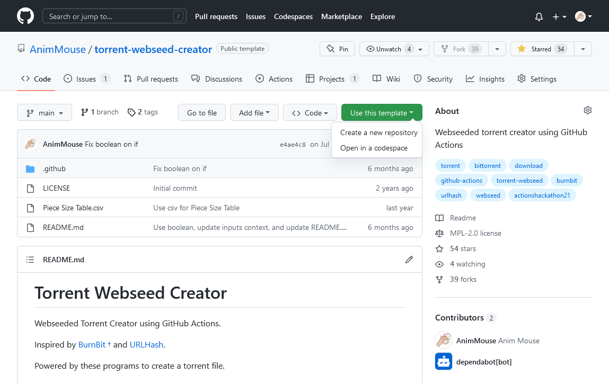
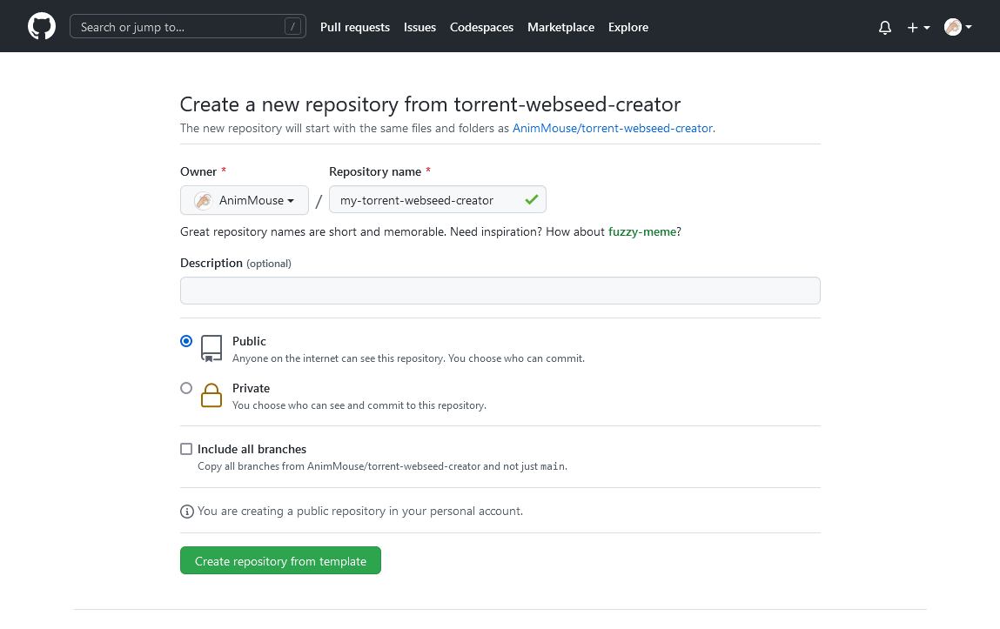
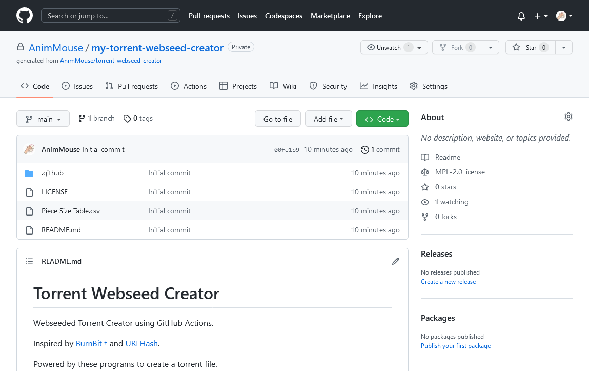
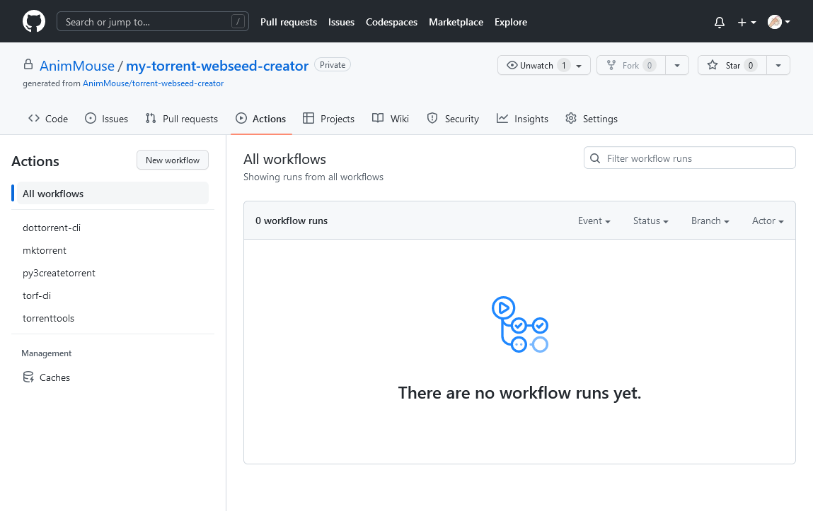
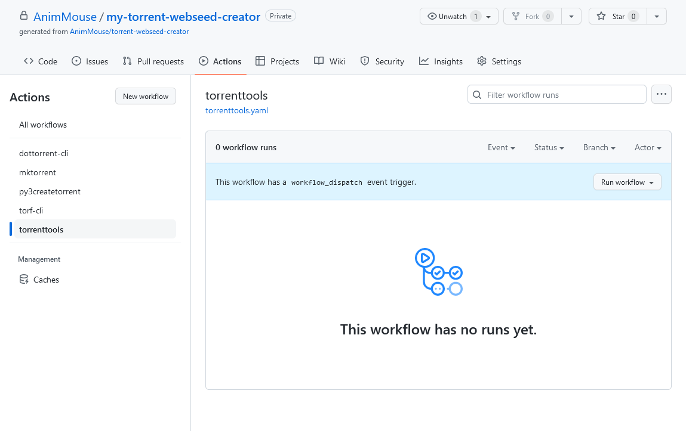
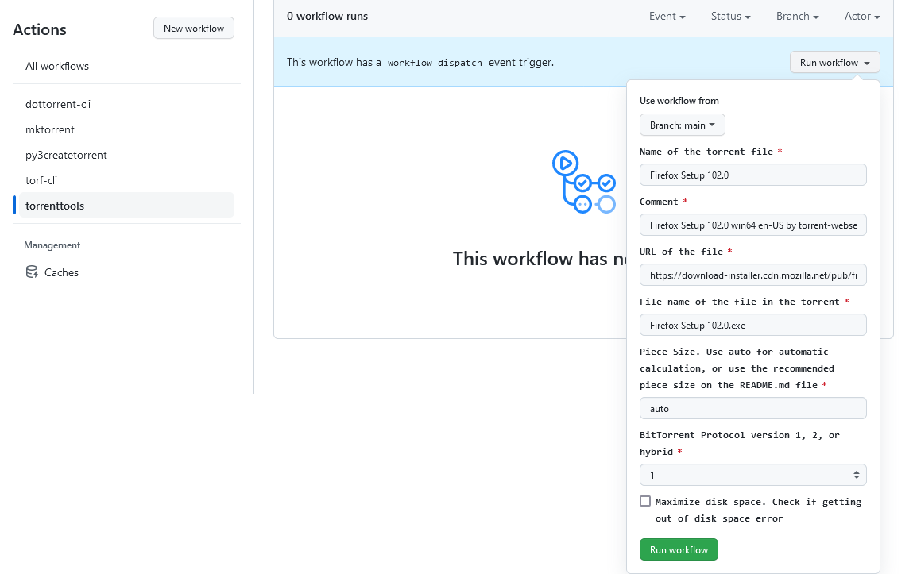
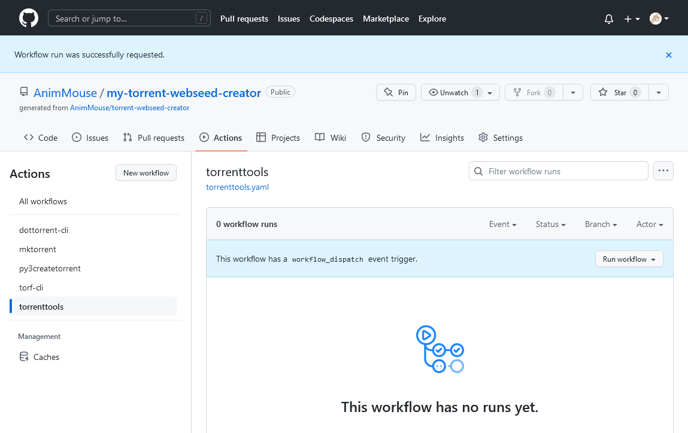
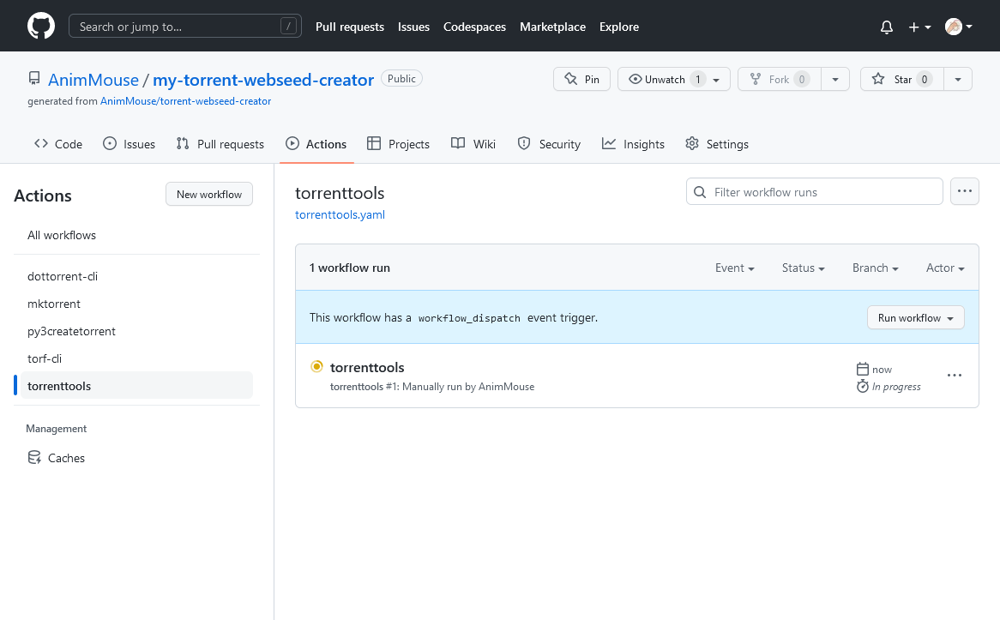
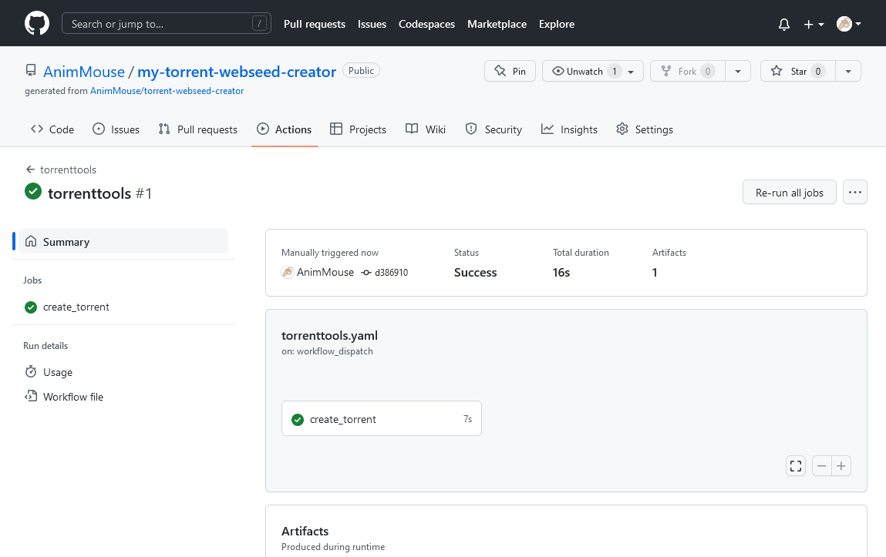
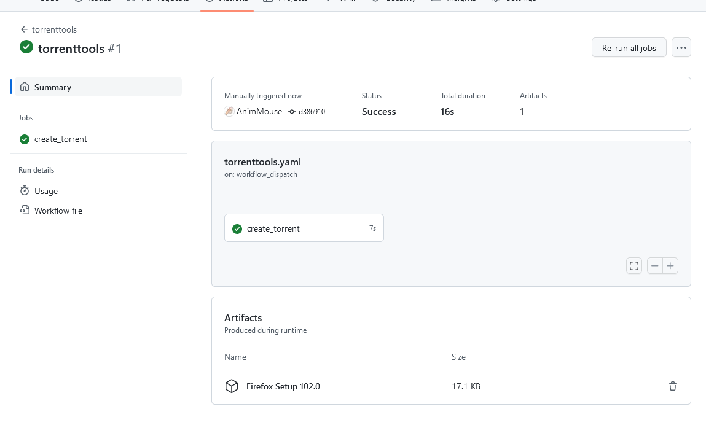

Torrent Webseed Creator is the alternative to BurnBit and URLHash.

1. Click "Use this template" and then click "Create a new repository".

2. Type your own repository name, and then click "Create repository from template".

3. Now, you will be redirected to your own repository generated from my template.

4. Go to the Actions tab, and select which one program you will use to create your own torrent. I recommend using torrenttools, but you can use any of them.

 

5. Click "Run workflow", and input the information about the file you want to create torrent from. I have prefilled the inputs to serve as a guide. And then click "Run workflow" inside the dropdown box. For more information about the inputs, refer to the [README.md](https://github.com/AnimMouse/torrent-webseed-creator/blob/main/README.md#how-to-use) file.

6. The workflow run has been requested, reload the page to see the running action.

 

7. Click the name of the program you used (In this case: torrenttools) and go to the Artifacts produced during runtime, and then click the name of the torrent you created. This will download the .torrent file inside a .zip file.

 