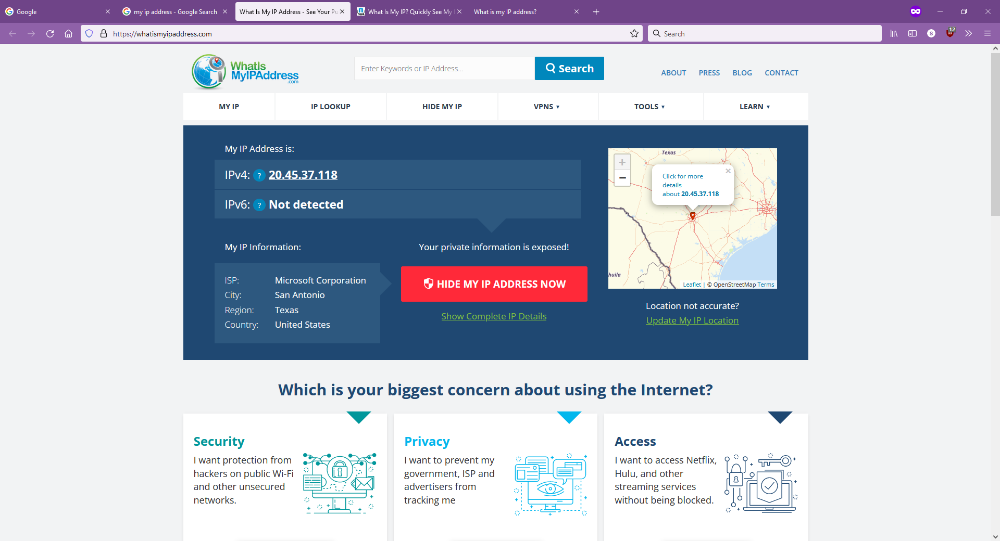
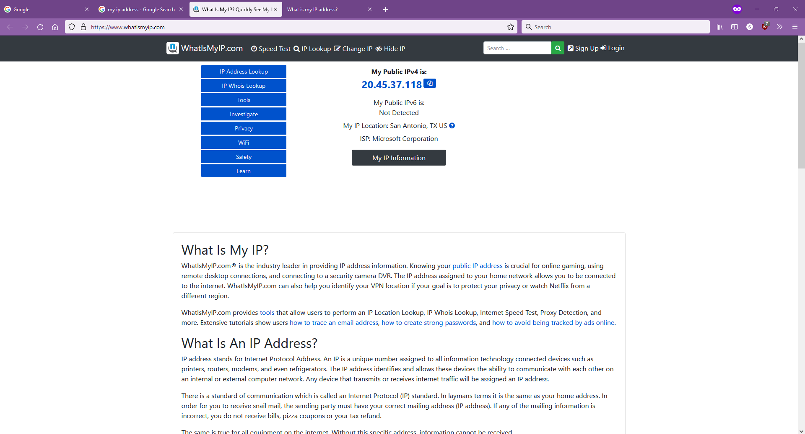
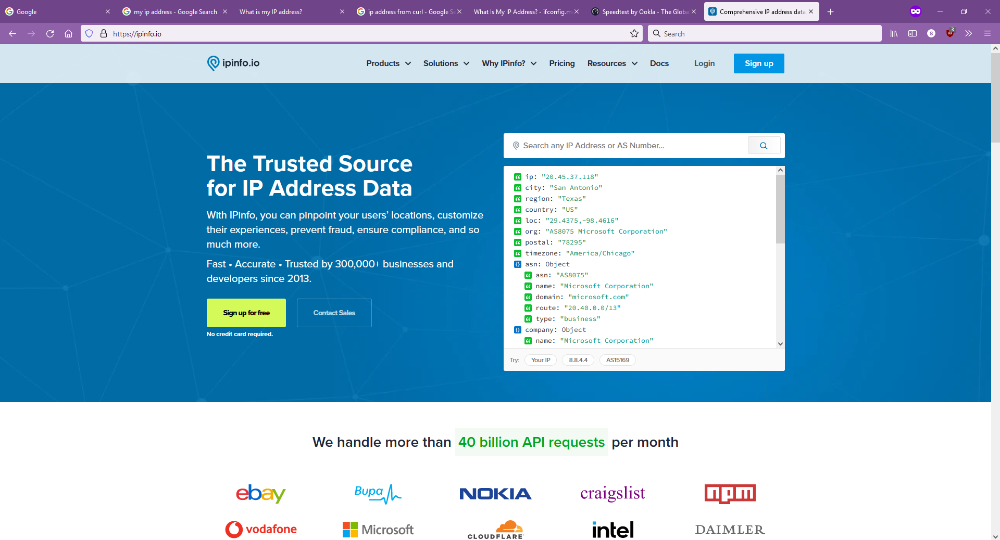
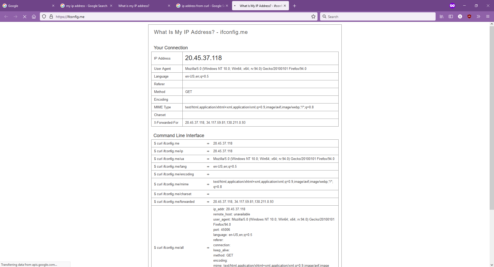
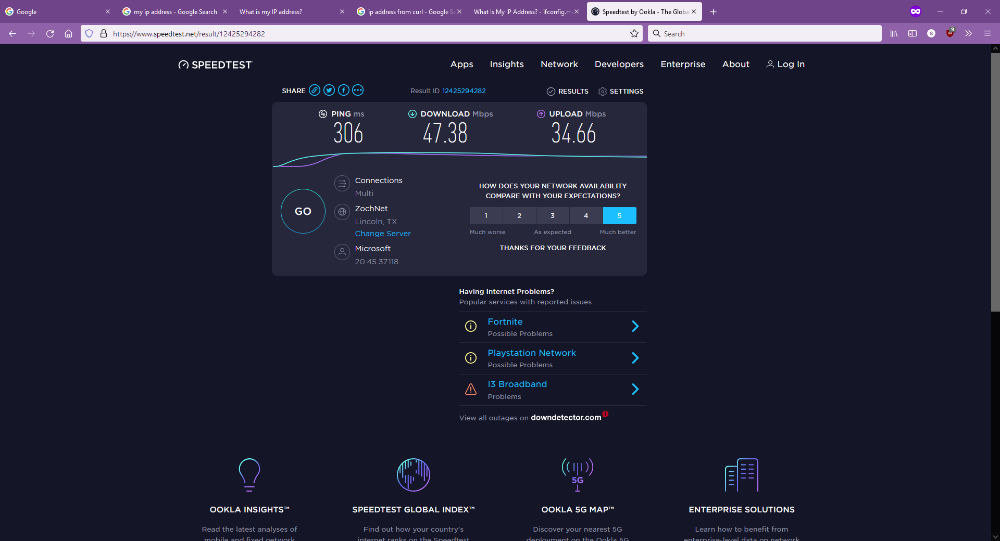

## GitHub Actions Hackathon 2021

Since GitHub Actions is an IaaS, and Actions Hackathon 2021 allows Wacky Wildcards, I wonder if I can use it as a proxy and view the internet from the perspective of GitHub's servers. So I created a proof of concept SOCKS5 proxy hosted on GitHub Actions.

As GitHub Actions runners are firewalled from incoming connections, what I did is connect to it through Cloudflare Tunnel. And as Cloudflare Tunnel can't tunnel TCP connections (we can use Ngrok but that's for another story), we tunnel SOCKS5 through websockets using Chisel.

Here you can see that I'm browsing the internet using Microsoft's IP address.

\
\
\

Here you can see a speed test from my 45 mbps internet connection.

This action can also be used as a VPN.